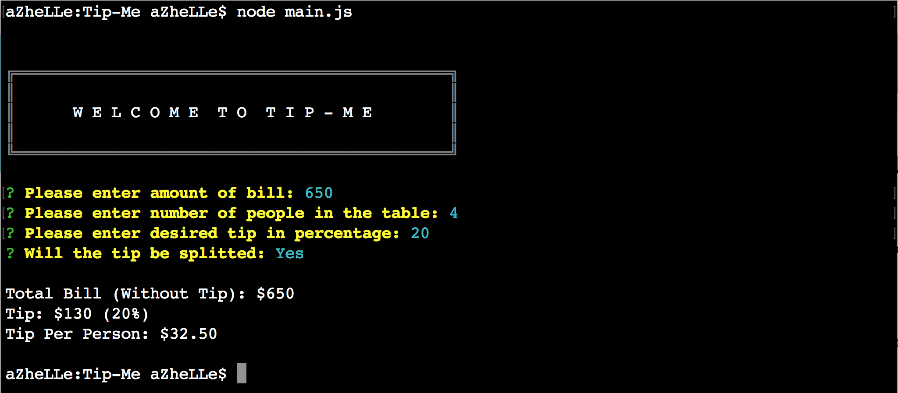

# TIP-ME (Command-Line)

### Description

This _TIP-ME_ version is a command line node application that serves as a tip calculator.

### How It Works

1. Run the following command to install the packages:

	- npm install

2. Once package has been installed, you can now run the application with the following command:

	node main.js
		

### Why Use The Packages Instead Of A Single Command Line Input?

CLI-Table logs the welcome sign with a less code

Inquirer allows the developer to create prompts with validations if needed

The user doesn't need to memorize the order of the command line input hence less prone of making errors in the computation.